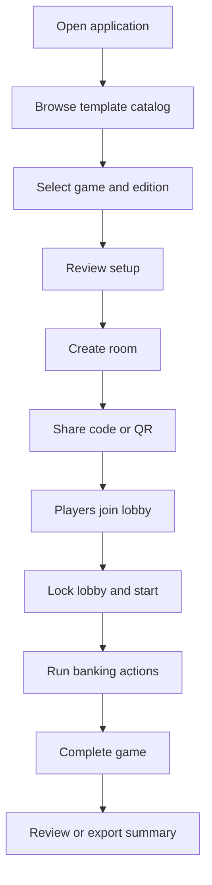
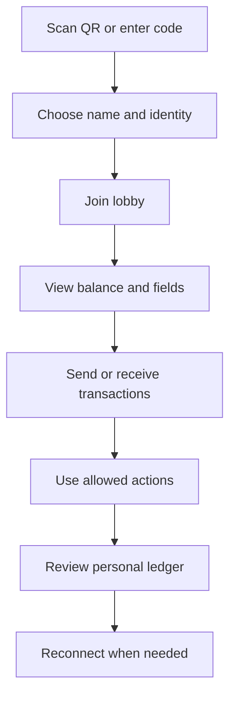
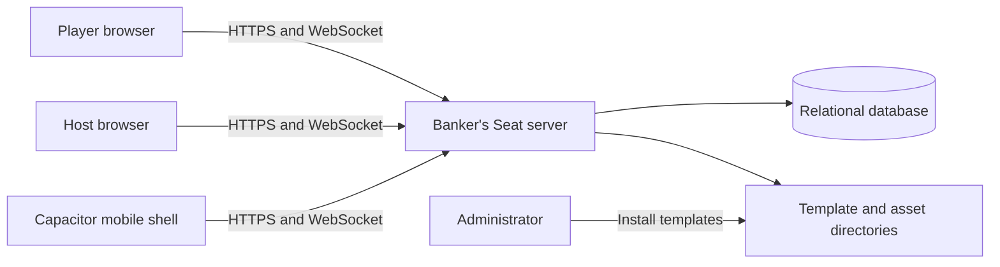
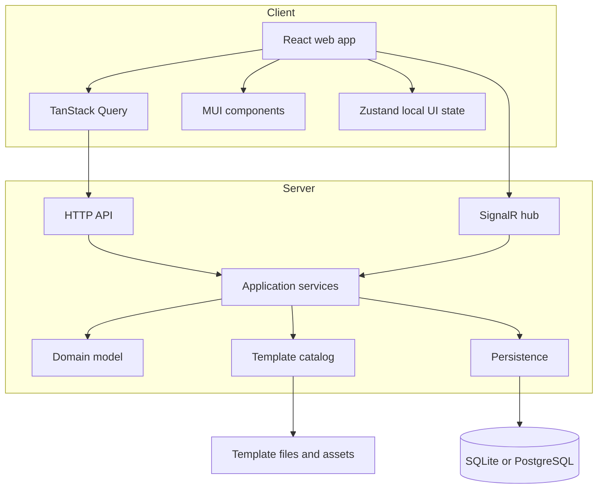
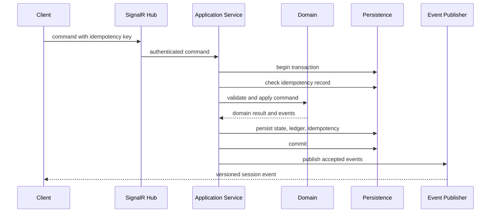

# Banker's Seat — Complete Planning Pack

This combined file mirrors the individual planning documents included in this package.


---

# Banker's Seat

Banker's Seat is a browser-first companion app that acts as the banker and shared record keeper for tabletop games. Several players join a live game session from their own devices, while a host creates the session from a JSON-defined game template.

The product is designed for games that use money, periodic payments, player-owned assets, life-state attributes, or other values that are traditionally tracked with paper money, tokens, cards, or handwritten notes.

> **Project status:** planning package. The product name is intentionally generic and can be renamed without changing the architecture.

## Product goals

- Replace repetitive banker work without replacing the physical board game.
- Let players join quickly with a room code or QR code.
- Keep balances and custom player attributes synchronized in real time.
- Load game definitions from validated JSON templates.
- Support multiple editions of the same game as distinct templates.
- Allow game-specific logos and other images without coupling the application to any one game.
- Preserve a complete, human-readable ledger with safe undo and correction workflows.
- Start as a responsive web app and later ship as an installable hybrid mobile app.

## Recommended stack

| Area | Technology |
|---|---|
| Web client | React, TypeScript, Vite, MUI |
| Client state | TanStack Query for server state; Zustand for local UI state |
| Routing | React Router |
| Server | ASP.NET Core with SignalR |
| Persistence | SQLite for local/self-hosted use; PostgreSQL for hosted production |
| Validation | JSON Schema for templates; server-side domain validation for commands |
| Testing | Vitest, React Testing Library, Playwright, xUnit |
| Mobile path | Capacitor wrapping the responsive web application |
| Repository | pnpm workspace with a .NET solution |

The backend recommendation reflects the need for authoritative, concurrent financial operations. The web application remains React and TypeScript, while the server owns session state and ledger integrity.

## Repository shape

```text
bankers-seat/
├── AGENTS.MD
├── README.md
├── apps/
│   ├── server/
│   └── web/
├── packages/
│   ├── template-contracts/
│   ├── template-tools/
│   └── ui/
├── templates/
│   ├── schema/
│   ├── built-in/
│   └── samples/
├── tests/
│   ├── e2e/
│   ├── integration/
│   └── template-validation/
└── docs/
```

## Planning document index

Start with `docs/INDEX.md`. The highest-value documents are:

1. `docs/01-product-vision.md`
2. `docs/04-system-architecture.md`
3. `docs/05-domain-model.md`
4. `docs/06-template-system.md`
5. `docs/07-template-json-specification.md`
6. `docs/08-realtime-and-concurrency.md`
7. `docs/15-roadmap.md`
8. `AGENTS.MD`

## Fundamental invariants

1. The server is authoritative for shared game state.
2. Money is stored as integers in the template's base unit; floating-point arithmetic is prohibited.
3. Every balance change produces an immutable ledger entry.
4. Every game session stores a snapshot of the template used to create it.
5. Commands that can be retried carry an idempotency key.
6. Templates are declarative data and cannot execute code.
7. A template is uniquely identified by template ID, edition, and template version.
8. Asset paths are relative, validated, and served from controlled template directories.

## Included examples

The planning package includes two original, generic sample templates:

- `generic-property-trading`
- `generic-life-journey`

They demonstrate the template system without copying proprietary game content, trademarks, artwork, or rule text.


---

# Product Vision

## Vision statement

Banker's Seat makes money handling and state tracking during physical board games fast, trustworthy, and accessible. Players continue using the real board, cards, pieces, and social interaction while the app handles balances, payments, shared records, and optional custom attributes.

## Problem

Many board games require one person to act as banker, repeatedly count money, resolve transfers, remember periodic payments, and track player-specific facts. This creates several problems:

- The banker spends less time playing.
- Manual money handling slows the game.
- Mistakes are difficult to reconstruct.
- Some editions have different denominations, starting values, or rules.
- Physical components can be lost or inconvenient.
- Player-specific state may be spread across cards, tokens, and notes.
- Accessibility needs can make small currency, crowded tables, or mental arithmetic difficult.

## Product promise

A host chooses a template, starts a room, and shares a code or QR code. Each player joins from a phone, tablet, or browser. The server maintains the authoritative game state. Templates define the game's banker-related setup and actions without requiring application code changes.

## Product principles

1. **Assist the table, do not replace it.** The physical game remains central.
2. **Trust before speed.** Every financial change is visible and auditable.
3. **Fast table interaction.** Common actions should take only a few taps.
4. **Edition-aware configuration.** Different editions are separate, selectable definitions.
5. **Template-driven extensibility.** New games can be supported through safe JSON.
6. **Mobile-first responsiveness.** The first web UI must work well on phones.
7. **No arbitrary template code.** Flexibility cannot compromise security.
8. **Recoverability.** Refreshes, temporary disconnections, and accidental actions must be survivable.
9. **Accessible by default.** Large touch targets, keyboard support, clear contrast, and screen-reader semantics are core requirements.
10. **Respect intellectual property.** Generic examples and user-supplied assets should be the default until licensed content is available.

## Primary personas

### Casual host

Wants to start a game quickly, invite family or friends, choose an edition, and avoid bookkeeping.

### Player

Wants a clear balance, quick transfer controls, personal attributes, and confidence that actions are correct.

### Dedicated banker

Wants a high-density console to issue payments, collect fees, correct mistakes, and review the ledger.

### Template creator

Wants to define or adapt a game using JSON, assets, schema validation, and useful error messages.

### Self-hosting administrator

Wants a Docker-deployable service, local persistence, backup, health checks, and predictable upgrades.

## Core success metrics

- Median time from opening the app to a joinable lobby.
- Median number of taps for common transactions.
- Percentage of sessions completed without manual state reset.
- Reconnection success rate.
- Command failure rate and duplicate-command prevention rate.
- Template validation success and quality of error messages.
- User-reported banker workload reduction.
- Accessibility audit results.
- Session completion and return usage.

## Non-goals for the initial product

- Full digital simulation of board movement, cards, dice, or proprietary rule systems.
- Real-money financial transactions.
- Gambling, wagering, or cash settlement.
- Arbitrary scripting in templates.
- A public marketplace at initial launch.
- Cross-session social networking.
- Voice control in the MVP.
- Automated recognition of physical cards or board state.


---

# Scope and Requirements

## MVP functional requirements

### Template catalog

- Discover built-in and administrator-installed JSON templates.
- Validate every template before it appears in the catalog.
- Display game name, edition, template version, description, player range, and logo.
- Distinguish editions as separate selectable entries.
- Report invalid templates to administrators without breaking valid templates.
- Support a generic fallback graphic when no logo is supplied.

### Session creation

- Let a host select a template and create a game.
- Generate a short room code and QR code.
- Allow the host to choose permitted template options.
- Persist a snapshot of the selected template.
- Support the template-defined minimum and maximum player counts.
- Let the host lock the lobby and start the game.

### Joining

- Join by room code, link, or QR code.
- Enter a display name and choose an available color/avatar.
- Receive a reconnect credential.
- Prevent duplicate active names within a room unless the host explicitly allows them.
- Rejoin after refresh or temporary network loss.

### Player state

- Show current balance prominently.
- Show custom fields defined by the template.
- Respect visibility and editability rules.
- Allow host-approved edits to tracked fields.
- Support field types: boolean, integer, text, enum, currency, and counter.

### Banking

- Bank-to-player payment.
- Player-to-bank payment.
- Player-to-player transfer.
- Template-defined one-tap payment or collection actions.
- Payday or periodic payment actions.
- Multi-player batch payments.
- Optional overdraft policy.
- Transaction note.
- Confirmation for unusually large or destructive actions.

### Ledger and corrections

- Immutable chronological ledger.
- Per-player and session-wide views.
- Actor, timestamp, amount, source, destination, action type, and note.
- Safe correction by compensating transaction.
- Optional host-only undo for the latest eligible action.
- Clear visual relationship between an original transaction and its correction.

### Session lifecycle

- Lobby, active, paused, completed, and archived states.
- Host pause and resume.
- Host transfer to another connected player.
- Completion summary.
- Export session data as JSON.
- Optional printable summary later.

## Post-MVP functional requirements

- User accounts and saved profile preferences.
- Cloud synchronization across devices.
- Template import and export packages.
- Visual template editor.
- Public or private template library.
- Team or household template sharing.
- Saved game resume across multiple days.
- Custom action groups and contextual menus.
- Per-player PINs.
- Spectator mode.
- Remote host administration.
- Local-network discovery.
- Localization and multiple currencies/number formats.
- Optional offline single-device banker mode.

## Non-functional requirements

### Correctness

- Atomic transactions.
- Deterministic command processing.
- Idempotent retries.
- Versioned state.
- No floating-point money.
- Active sessions immune to template file changes.

### Performance

- Common commands acknowledged in under 300 ms on a normal local network.
- Real-time updates visible to connected players shortly after acceptance.
- Initial session snapshot remains practical for sessions with at least 20 players and 10,000 ledger entries.
- Large ledgers use pagination or virtualization.

### Availability and recovery

- Browser refresh does not lose player identity when reconnect credentials are valid.
- Server restart can restore persisted sessions.
- Database backups are documented.
- A client detects stale state and resynchronizes automatically.

### Security

- Authorization on every mutation.
- Rate limiting for join and command endpoints.
- No executable template content.
- Safe asset serving.
- HTTPS for hosted deployments.
- Secrets stored outside source control.

### Accessibility

- WCAG 2.2 AA target.
- Touch targets suitable for phone use.
- Full keyboard navigation.
- Screen-reader labels.
- Reduced-motion mode.
- No color-only meaning.

### Maintainability

- Modular architecture.
- Versioned contracts.
- Automated schema validation.
- Unit, integration, and end-to-end coverage.
- Architecture decision records for major choices.
- Documentation updated with behavior changes.

## Assumptions

- Players normally have access to a browser-capable device.
- The game is social and turn-based, not high-frequency.
- The server can be hosted locally or remotely.
- Templates represent banker-related behavior, not every game rule.
- All balances use integer base units.
- The host has elevated permissions but cannot erase audit history.


---

# User Stories and Flows

## Epic: Start a game

### Story

As a host, I want to choose a game and edition so that the correct banker setup is used.

### Acceptance criteria

- The catalog lists only validated templates.
- Each entry shows game name and edition.
- Selecting an entry shows player limits, starting balance, tracked fields, and available actions.
- Starting a game creates a template snapshot and room code.
- A template update after creation does not alter the session.

## Epic: Join a room

### Story

As a player, I want to scan a QR code and join quickly so that setup does not delay the game.

### Acceptance criteria

- The QR code opens the correct room.
- The player enters a display name.
- The server returns a participant ID and reconnect token.
- The lobby updates for all connected users.
- Refreshing the browser restores the same participant when the token remains valid.

## Epic: Perform a transfer

### Story

As a player, I want to pay another player so that the app records the transaction accurately.

### Acceptance criteria

- The player selects a recipient and amount.
- The client shows a clear confirmation.
- The server validates actor, recipient, amount, and overdraft policy.
- Debit and credit occur atomically.
- One ledger transaction links both sides of the transfer.
- All connected clients receive the accepted event.
- Repeating the same command with the same idempotency key does not duplicate the transfer.

## Epic: Use a game action

### Story

As a banker, I want one-tap actions such as payday or fees so that recurring transactions are fast.

### Acceptance criteria

- Actions come from the active template snapshot.
- The UI groups actions by template-defined category.
- The server maps the action to a known declarative operation.
- A batch action reports individual failures before committing, or commits atomically according to the action definition.
- The ledger identifies the action ID and display label.

## Epic: Track custom state

### Story

As a player, I want the app to track facts such as owning a home or having children so that I do not need separate notes.

### Acceptance criteria

- Fields are initialized from the template.
- Field type, limits, options, and default are enforced.
- Host-only fields cannot be modified by players.
- Private fields are visible only to authorized users.
- Every change is recorded in a field-change audit log.

## Epic: Correct a mistake

### Story

As a host, I want to correct an accidental transaction without hiding history.

### Acceptance criteria

- The original entry remains unchanged.
- The correction creates a compensating entry.
- The UI links the correction and original.
- The reason is required.
- Correcting the same entry twice is prevented unless an explicit subsequent adjustment is used.

## Epic: Recover from disconnection

### Story

As a player, I want to reconnect without losing my identity or balance.

### Acceptance criteria

- The client reconnects using a protected token.
- The server sends missed events when feasible or a fresh snapshot.
- The client compares session versions.
- Duplicate commands caused by retries remain idempotent.
- The UI clearly shows disconnected, reconnecting, and synchronized states.

## Primary host journey



## Primary player journey



## Important error flows

- Invalid or expired room code.
- Room locked or full.
- Duplicate display name.
- Player removed by host.
- Insufficient funds.
- Stale command/session version.
- Disconnected during submission.
- Template action unavailable in current session state.
- Invalid field value.
- Correction already applied.
- Session completed or archived.


---

# System Architecture

## Architectural style

Use a modular monolith for the initial release:

- React and TypeScript single-page application.
- ASP.NET Core HTTP API.
- SignalR hub for commands and events.
- Relational persistence.
- File-system-backed template catalog.
- Shared operational deployment.

A modular monolith keeps transactions and deployment simple while preserving boundaries that can later be extracted if scale requires it.

## Context diagram



## Container diagram



## Client modules

### App shell

- Routing.
- Error boundaries.
- Theme.
- localization infrastructure.
- network status.
- install/PWA prompts.

### Template catalog

- Catalog list and filtering.
- Edition details.
- Asset rendering.
- Setup preview.
- Host configuration.

### Lobby

- Room code.
- QR code.
- participant list.
- host controls.
- identity selection.
- connection status.

### Game workspace

- Player balance.
- Custom fields.
- Quick actions.
- Transfer flow.
- Banker console.
- Ledger.
- Session controls.

### Client state rules

- TanStack Query owns HTTP-fetched server state.
- SignalR events update or invalidate relevant query data.
- Zustand stores ephemeral UI state such as open drawers, selected player, pending forms, and local preferences.
- Do not maintain an independent copy of the complete authoritative session in multiple stores.
- A normalized session view model may be derived from the latest server snapshot plus ordered events.

## Server modules

### Sessions

Creates, starts, pauses, completes, and archives game sessions.

### Participants

Handles join, reconnect, host transfer, removal, identity, and permissions.

### Banking

Handles payments, collections, transfers, batch actions, and corrections.

### Player fields

Validates and changes custom template-defined values.

### Templates

Discovers, validates, hashes, versions, and serves templates and assets.

### Real-time gateway

Maps authenticated hub commands to application command handlers and publishes accepted events.

### Persistence

Stores sessions, participants, ledger entries, field values, idempotency records, and template snapshots.

## Deployment modes

### Local single-host

- Docker Compose.
- SQLite.
- Mounted template directory.
- Suitable for home and local network use.

### Hosted single-instance

- Container platform or VM.
- PostgreSQL.
- Object storage or managed volume for template assets.
- Reverse proxy and HTTPS.

### Future horizontally scaled

- PostgreSQL.
- SignalR backplane or managed real-time service.
- Distributed cache for transient connection metadata.
- Shared template/object storage.
- Sticky sessions only if required by the chosen hosting model.

## Repository structure

```text
apps/
  web/
    src/
      app/
      features/
      components/
      hooks/
      lib/
      routes/
  server/
    Api/
    Application/
    Domain/
    Infrastructure/
    Realtime/
packages/
  template-contracts/
  template-tools/
  ui/
templates/
  schema/
  built-in/
  samples/
tests/
  e2e/
  integration/
  template-validation/
```

## Cross-language contracts

JSON Schema is the canonical contract for game templates. HTTP and hub DTOs are explicitly versioned and represented in both TypeScript and C#.

Avoid allowing UI framework types into shared contracts. Runtime validation is required at external boundaries even when compile-time types exist.

## Key design choices

- Server-authoritative state prevents clients from forging balances.
- Append-only ledger preserves trust and correction history.
- Template snapshotting prevents configuration drift.
- Declarative operations avoid unsafe scripting.
- SignalR provides practical real-time behavior with the preferred backend stack.
- Capacitor preserves the React codebase for mobile packaging.


---

# Domain Model

## Aggregate boundaries

The primary aggregate is `GameSession`. It coordinates lifecycle, participants, accounts, field values, and accepted commands. Ledger entries are append-only records produced by the aggregate's command handlers.

For larger deployments, ledger storage may be optimized separately, but transaction acceptance remains coordinated by the session boundary.

## Core entities

### GameSession

| Field | Description |
|---|---|
| `id` | Globally unique session ID |
| `roomCode` | Short join code |
| `status` | Lobby, active, paused, completed, archived |
| `hostParticipantId` | Current host |
| `templateSnapshotId` | Immutable template snapshot |
| `sessionVersion` | Monotonically increasing accepted-change version |
| `createdAtUtc` | Creation time |
| `startedAtUtc` | Optional start time |
| `completedAtUtc` | Optional completion time |
| `settings` | Session-level permitted overrides |

### TemplateSnapshot

| Field | Description |
|---|---|
| `id` | Snapshot ID |
| `templateId` | Stable template identity |
| `edition` | Edition identity |
| `templateVersion` | Template's semantic version |
| `schemaVersion` | JSON Schema version |
| `contentHash` | Hash of normalized template content |
| `templateJson` | Full validated template |
| `createdAtUtc` | Snapshot time |

### Participant

| Field | Description |
|---|---|
| `id` | Participant ID |
| `sessionId` | Parent session |
| `displayName` | Table-facing name |
| `role` | Host, player, banker, spectator |
| `identityKey` | Selected color/avatar identity |
| `status` | Invited, connected, disconnected, removed |
| `joinOrder` | Stable table ordering |
| `reconnectSecretHash` | Protected reconnect credential |
| `createdAtUtc` | Join time |

### Account

| Field | Description |
|---|---|
| `id` | Account ID |
| `sessionId` | Parent session |
| `ownerType` | Bank, participant, or named shared account |
| `ownerId` | Participant or configured account ID |
| `balance` | Integer base units |
| `version` | Concurrency token |

### LedgerTransaction

A logical operation that may contain one or more balanced ledger postings.

| Field | Description |
|---|---|
| `id` | Transaction ID |
| `sessionId` | Session |
| `sequence` | Strict session order |
| `commandId` | Originating command |
| `actorParticipantId` | Actor |
| `actionId` | Optional template action |
| `kind` | Payment, collection, transfer, adjustment, correction |
| `note` | Optional explanation |
| `correctsTransactionId` | Optional original transaction |
| `createdAtUtc` | Acceptance time |

### LedgerPosting

| Field | Description |
|---|---|
| `id` | Posting ID |
| `transactionId` | Parent transaction |
| `accountId` | Affected account |
| `amount` | Signed integer base units |
| `balanceAfter` | Resulting account balance |

For a transfer, the sum of postings is zero when the bank is modeled as a normal account. Unlimited-bank templates may use a virtual source/sink policy, but the player account mutation must still be recorded.

### PlayerFieldDefinition

Stored in the template snapshot. Defines a stable field ID, label, type, default, limits, options, visibility, and edit permissions.

### PlayerFieldValue

| Field | Description |
|---|---|
| `sessionId` | Session |
| `participantId` | Owner |
| `fieldId` | Stable template field ID |
| `valueJson` | Validated typed value |
| `version` | Concurrency token |
| `updatedAtUtc` | Update time |

### FieldChange

Append-only audit record for a field mutation.

## Value objects

- `MoneyAmount` — signed 64-bit integer base units.
- `RoomCode` — normalized short code.
- `TemplateIdentity` — template ID, edition ID, template version.
- `SessionVersion` — monotonically increasing integer.
- `IdempotencyKey` — client-generated unique string scoped to actor/session.
- `AssetPath` — validated relative path.
- `FieldId`, `ActionId`, `ParticipantId`, `AccountId`.

## Commands

- `CreateSession`
- `JoinSession`
- `ReconnectParticipant`
- `StartSession`
- `PauseSession`
- `ResumeSession`
- `CompleteSession`
- `TransferHost`
- `RemoveParticipant`
- `PayFromBank`
- `CollectToBank`
- `TransferBetweenPlayers`
- `ExecuteTemplateAction`
- `UpdatePlayerField`
- `CorrectTransaction`
- `AddTransactionNote`

## Domain events

- `SessionCreated`
- `ParticipantJoined`
- `ParticipantReconnected`
- `SessionStarted`
- `SessionPaused`
- `SessionResumed`
- `SessionCompleted`
- `HostTransferred`
- `ParticipantRemoved`
- `TransactionPosted`
- `TransactionCorrected`
- `PlayerFieldChanged`
- `SessionSnapshotRequired`

## Invariants

1. A completed or archived session rejects financial mutations.
2. A lobby session rejects normal gameplay transactions unless explicitly allowed for setup.
3. Every participant account belongs to the same session as the command.
4. A transfer amount is positive at the command boundary.
5. A transaction's postings are atomic.
6. Overdraft policy is enforced before mutation.
7. A correction cannot erase or alter the original transaction.
8. A single original transaction cannot be corrected twice by the simple correction command.
9. Stable template IDs and field/action IDs cannot be duplicated.
10. The session version increments once per accepted state-changing command.
11. The same actor/idempotency key returns the original accepted result.
12. A running session uses only its template snapshot.

## Command processing sequence




---

# Template System

## Purpose

Templates define banker-related configuration and safe actions without requiring a new application build. A template may describe:

- Game and edition metadata.
- Player count.
- Currency label and denominations.
- Starting balances.
- Bank policy.
- Player custom fields.
- Common actions.
- Payday or periodic payments.
- Session options.
- Logos and supporting images.

Templates do not define executable code.

## Template identity

A template has three important identifiers:

- `templateId` — stable identity for the general template.
- `edition.id` — stable identity for a specific edition.
- `templateVersion` — semantic version of this template definition.

The unique catalog key is:

```text
templateId + edition.id + templateVersion
```

The catalog may show only the latest compatible version by default while retaining older versions for diagnostics and imports.

## Directory model

Recommended server directory structure:

```text
templates/
  built-in/
    template-folder/
      template.json
      assets/
  installed/
    template-folder/
      template.json
      assets/
  invalid/
```

The server scans configured roots at startup. In development and self-hosted deployments, a file watcher may trigger a debounced rescan. Production systems should allow rescanning through an administrator endpoint.

## Automatic detection

A browser cannot safely scan arbitrary directories on a user's device. Therefore, automatic detection occurs on the server:

1. Enumerate allowed template roots.
2. Find files named `template.json`.
3. Parse JSON with strict limits.
4. Validate against JSON Schema.
5. Perform semantic validation.
6. Validate referenced assets.
7. Calculate content and asset hashes.
8. Add valid entries to the catalog.
9. Record invalid entries with actionable diagnostics.

A static client-only demo may use Vite's `import.meta.glob`, but the multiplayer product should use the server catalog.

## Validation layers

### JSON syntax

Reject malformed JSON and report line/column when available.

### JSON Schema

Validate required fields, types, formats, ranges, and known operation shapes.

### Semantic validation

Examples:

- Duplicate denomination values.
- Duplicate field or action IDs.
- Action references a missing field.
- Enum default not present in options.
- Minimum players greater than maximum.
- Asset path escapes the template directory.
- Edition ID missing while edition name is present.
- Starting balance violates a configured non-negative rule.
- Batch action expands beyond safety limits.

### Asset validation

- Paths must be relative.
- Reject `..`, rooted paths, device paths, and symbolic-link escapes.
- Allow only configured file types such as PNG, JPEG, WebP, and SVG after safe SVG handling.
- Enforce file-size and dimension limits.
- Serve assets from a dedicated route with safe headers.
- Do not execute embedded scripts.
- Remote assets are disabled by default.

## Catalog behavior

Each catalog entry contains:

- Template identity.
- Display name.
- Edition name and release label.
- Description.
- Player range.
- Thumbnail/logo URL.
- Template version.
- Validation status.
- Source type: built-in, installed, imported, or administrative.
- Content hash.
- Last discovered time.

Invalid templates must not be selectable, but administrators need access to diagnostics.

## Session snapshot

When a session is created, persist:

- Entire validated template JSON.
- Template identity.
- Schema version.
- Content hash.
- Resolved session settings.
- Asset package identity or immutable asset references.

The session must never reread live template data during gameplay.

## Template compatibility

### Schema version

`schemaVersion` controls the structural contract. The application supports a declared range of schema versions.

### Template version

`templateVersion` describes content changes by template authors.

Suggested semantics:

- Patch: labels, descriptions, or graphics without behavioral changes.
- Minor: additive fields or actions with compatible defaults.
- Major: breaking behavior or identity changes.

### Migration

Do not automatically migrate active sessions. Catalog templates may be migrated by an explicit administrative tool that produces a new file and report.

## Import/export package

A future package format can be a ZIP with:

```text
template.json
assets/
manifest.json
signature.json
```

Package extraction must defend against zip-slip, file bombs, excessive file counts, and unsupported types.

## Template authoring tools

Planned tools:

- CLI validator.
- Schema-aware editor support.
- Human-readable diagnostics.
- Preview catalog card.
- Preview player fields and action buttons.
- Template diff.
- Package builder.
- Optional visual editor after the schema stabilizes.

## Intellectual property policy

The repository should contain only original, licensed, or clearly permitted content. Generic templates may demonstrate property trading, life journeys, paydays, and similar mechanics without copying proprietary names, logos, board layouts, card text, or rulebooks.


---

# Template JSON Specification

## Overview

The canonical machine-readable schema is:

```text
templates/schema/game-template.schema.json
```

This document explains the intent of the main fields.

## Root fields

| Field | Required | Purpose |
|---|---:|---|
| `schemaVersion` | Yes | Structural schema version |
| `templateId` | Yes | Stable lowercase kebab-case template ID |
| `templateVersion` | Yes | Semantic version of template content |
| `name` | Yes | Display name |
| `edition` | Yes | Edition identity and display metadata |
| `description` | No | Catalog and setup description |
| `playerCount` | Yes | Minimum and maximum participants |
| `currency` | Yes | Base-unit label and formatting |
| `denominations` | No | Optional physical-style denominations |
| `bank` | Yes | Starting values and overdraft behavior |
| `assets` | No | Logo and related images |
| `playerFields` | No | Custom tracked player state |
| `actions` | No | Declarative quick actions |
| `sessionOptions` | No | Host-selectable settings |
| `tags` | No | Catalog search tags |

## Edition

```json
{
  "id": "classic-edition",
  "name": "Classic Edition",
  "releaseLabel": "Original rules",
  "year": 2026
}
```

`edition.id` is part of template identity. Do not rely on `edition.name` as an ID.

## Currency

```json
{
  "code": "GAME_CREDIT",
  "symbol": "¤",
  "name": "credits",
  "baseUnitName": "credit",
  "fractionDigits": 0,
  "position": "before"
}
```

Although the schema permits a formatting declaration, the domain stores amounts as integers. The initial product should require `fractionDigits` to be zero unless a future fixed-point implementation is added.

## Denominations

```json
[
  { "value": 1, "label": "1", "asset": "assets/money-1.webp" },
  { "value": 5, "label": "5", "asset": "assets/money-5.webp" },
  { "value": 10, "label": "10", "asset": "assets/money-10.webp" }
]
```

Denominations are presentation metadata. Transactions may still use any integer amount unless a template explicitly restricts amounts to denomination combinations.

## Bank configuration

```json
{
  "startingPlayerBalance": 1500,
  "bankMode": "unlimited",
  "allowPlayerOverdraft": false
}
```

Supported initial bank modes:

- `unlimited` — player balances are tracked; bank supply is not depleted.
- `finite` — the bank has a tracked account and starting supply.

## Assets

```json
{
  "logo": "assets/logo.webp",
  "thumbnail": "assets/thumbnail.webp",
  "background": "assets/background.webp",
  "images": {
    "home": "assets/home.webp",
    "children": "assets/children.webp"
  }
}
```

All paths are relative to the template directory and validated by the server.

## Player fields

### Boolean

```json
{
  "id": "owns-home",
  "label": "Owns a home",
  "type": "boolean",
  "default": false,
  "visibility": "all",
  "editableBy": "host-and-owner",
  "iconAssetKey": "home"
}
```

### Counter

```json
{
  "id": "children-count",
  "label": "Children",
  "type": "counter",
  "default": 0,
  "minimum": 0,
  "maximum": 12,
  "step": 1,
  "visibility": "all",
  "editableBy": "host-and-owner"
}
```

### Enum

```json
{
  "id": "career",
  "label": "Career",
  "type": "enum",
  "default": "none",
  "options": [
    { "value": "none", "label": "None" },
    { "value": "technical", "label": "Technical" },
    { "value": "creative", "label": "Creative" }
  ],
  "visibility": "all",
  "editableBy": "host"
}
```

Supported initial field types:

- `boolean`
- `integer`
- `counter`
- `text`
- `enum`
- `currency`

Field visibility:

- `all`
- `owner-and-host`
- `host-only`

Edit permission:

- `host`
- `owner`
- `host-and-owner`
- `system`

## Actions

Actions use a closed set of declarative operation types.

### Fixed bank payment

```json
{
  "id": "payday",
  "label": "Payday",
  "category": "income",
  "scope": "single-player",
  "operation": {
    "type": "bank-to-player",
    "amount": 500
  },
  "confirmation": "never"
}
```

### Player fee

```json
{
  "id": "service-fee",
  "label": "Service fee",
  "category": "expense",
  "scope": "single-player",
  "operation": {
    "type": "player-to-bank",
    "amount": 100
  },
  "confirmation": "always"
}
```

### Update a field

```json
{
  "id": "buy-home",
  "label": "Buy home",
  "category": "life-event",
  "scope": "single-player",
  "operation": {
    "type": "composite",
    "steps": [
      {
        "type": "player-to-bank",
        "amount": 2000
      },
      {
        "type": "set-field",
        "fieldId": "owns-home",
        "value": true
      }
    ],
    "atomic": true
  },
  "confirmation": "always"
}
```

Initial operation types:

- `bank-to-player`
- `player-to-bank`
- `player-to-player`
- `adjust-player-balance`
- `set-field`
- `increment-field`
- `composite`

No operation may contain source code or expressions. Future conditional behavior must use a tightly controlled declarative condition grammar documented and validated separately.

## Session options

```json
[
  {
    "id": "starting-balance",
    "label": "Starting balance",
    "type": "integer",
    "default": 1500,
    "minimum": 0,
    "maximum": 100000,
    "mapsTo": "bank.startingPlayerBalance"
  }
]
```

Only whitelisted paths may be overridden. Arbitrary JSON-path mutation is not allowed.

## Limits

Recommended initial limits:

- 100 player fields.
- 200 actions.
- 50 denominations.
- 25 options per enum.
- 50 steps per composite action.
- 200 characters per label.
- 2,000 characters per description.
- 10 MB total asset package by default.
- 5 MB per image by default.

Limits should be configurable by administrators within safe maximums.


---

# Real-Time and Concurrency

## Goals

- All players see accepted changes quickly.
- Duplicate network retries do not duplicate transactions.
- Concurrent commands cannot corrupt balances.
- Reconnecting clients recover cleanly.
- Event order is explicit and testable.

## Transport

Use SignalR for:

- Session subscription.
- Mutating gameplay commands.
- Presence notifications.
- Accepted domain events.
- Snapshot/resynchronization requests.

Use HTTP for:

- Template catalog.
- Session creation.
- Initial join.
- Asset delivery.
- Administrative template operations.
- Exports.

Commands may also be exposed through HTTP for automation or diagnostics, but one authoritative application service must process both transports.

## Command envelope

```json
{
  "protocolVersion": 1,
  "commandId": "01JEXAMPLECOMMAND",
  "idempotencyKey": "client-generated-unique-value",
  "sessionId": "01JEXAMPLESESSION",
  "expectedSessionVersion": 42,
  "type": "transfer-between-players",
  "payload": {
    "fromParticipantId": "01JFROM",
    "toParticipantId": "01JTO",
    "amount": 200,
    "note": "Rent"
  }
}
```

## Event envelope

```json
{
  "protocolVersion": 1,
  "eventId": "01JEXAMPLEEVENT",
  "sessionId": "01JEXAMPLESESSION",
  "sessionVersion": 43,
  "type": "transaction-posted",
  "occurredAtUtc": "2026-07-17T12:00:00Z",
  "correlationId": "01JEXAMPLECOMMAND",
  "payload": {}
}
```

## Ordering

- Each accepted state change receives the next `sessionVersion`.
- Events for a session are published in session-version order.
- Clients track the latest applied version.
- If the next event version is not exactly current plus one, the client pauses incremental application and requests resynchronization.

## Idempotency

Idempotency records are scoped to session and actor.

Store:

- Actor participant ID.
- Idempotency key.
- Command type.
- Request hash.
- Accepted result or rejection category.
- Created time.
- Expiration policy.

If the same key is reused with a different request hash, reject it as a client error.

## Optimistic concurrency

The command may carry `expectedSessionVersion`.

Recommended behavior:

- Commands requiring strict current context reject stale versions.
- Simple independent transactions may be retried server-side against the newest version if their domain preconditions remain valid.
- The accepted result always returns the actual resulting session version.

The implementation should begin with strict version checks for clarity, then selectively relax them only with tests.

## Transaction boundary

A mutation must atomically persist:

- Account changes.
- Ledger transaction and postings.
- Player field changes.
- Session version.
- Idempotency record.
- Outbox event records when the outbox pattern is used.

Publish real-time events only after commit.

## Reconnection

1. Client detects transport loss.
2. UI changes to reconnecting state.
3. SignalR reconnects.
4. Client reauthenticates with participant credential.
5. Client sends last applied session version.
6. Server sends missing events if retained and reasonably small.
7. Otherwise server sends or instructs the client to fetch a fresh snapshot.
8. Client replaces server-derived state and resumes.

## Presence

Presence is transient and must not be the source of financial truth.

Track:

- Connection count per participant.
- Last seen time.
- Connected/disconnected display state.
- Host device state.

A participant may have multiple tabs or devices. Presence changes do not invalidate account ownership.

## Host disconnect

Recommended MVP behavior:

- Keep the host role for a grace period.
- Allow reconnect.
- Permit a host-authorized co-banker to continue normal actions.
- After a configurable timeout, allow explicit host transfer using a secure recovery rule.
- Never assign host solely based on first connected client without audit.

## Failure responses

Return structured errors:

```json
{
  "code": "insufficient-funds",
  "message": "Rob does not have enough funds for this payment.",
  "details": {
    "available": 150,
    "required": 200
  },
  "currentSessionVersion": 43,
  "retryable": false
}
```

Avoid exposing server stack traces to clients.


---

# API and Hub Contracts

## API conventions

- Base path: `/api/v1`
- JSON fields use camel case.
- Timestamps use UTC ISO 8601.
- Errors use a consistent problem-details shape.
- Mutating requests accept correlation and idempotency identifiers.
- Public contracts are additive within a major API version.

## Template endpoints

### `GET /api/v1/templates`

Returns validated catalog entries.

Query options may include:

- Search text.
- Tag.
- Player count.
- Template ID.
- Edition ID.
- Include invalid entries for authorized administrators.

### `GET /api/v1/templates/{templateId}/editions/{editionId}/versions/{templateVersion}`

Returns detailed setup information, not unrestricted server paths.

### `GET /api/v1/template-assets/{assetPackageId}/{assetPath}`

Returns a validated asset with safe headers.

### `POST /api/v1/admin/templates/rescan`

Triggers an authorized rescan and returns validation diagnostics.

## Session endpoints

### `POST /api/v1/sessions`

Creates a lobby.

Request:

```json
{
  "templateId": "generic-property-trading",
  "editionId": "standard-edition",
  "templateVersion": "1.0.0",
  "hostDisplayName": "Rob",
  "sessionOptions": {}
}
```

Response includes:

- Session ID.
- Room code.
- host participant ID.
- reconnect credential.
- initial session snapshot.
- SignalR connection information.

### `POST /api/v1/sessions/join`

Request:

```json
{
  "roomCode": "ABCD12",
  "displayName": "Player Two",
  "identityKey": "blue"
}
```

### `POST /api/v1/sessions/{sessionId}/reconnect`

Exchanges a valid reconnect credential for refreshed access.

### `GET /api/v1/sessions/{sessionId}/snapshot`

Returns the authorized current session view.

### `GET /api/v1/sessions/{sessionId}/ledger`

Supports cursor pagination and filters.

### `GET /api/v1/sessions/{sessionId}/export`

Returns an authorized JSON export.

## SignalR hub

Suggested path:

```text
/hubs/game
```

### Client-to-server methods

- `SubscribeSession`
- `StartSession`
- `PauseSession`
- `ResumeSession`
- `CompleteSession`
- `TransferHost`
- `RemoveParticipant`
- `PayFromBank`
- `CollectToBank`
- `TransferBetweenPlayers`
- `ExecuteTemplateAction`
- `UpdatePlayerField`
- `CorrectTransaction`
- `RequestResync`

Each mutating method receives a command envelope.

### Server-to-client events

- `SessionSnapshot`
- `ParticipantJoined`
- `ParticipantPresenceChanged`
- `SessionStatusChanged`
- `HostChanged`
- `TransactionPosted`
- `TransactionCorrected`
- `PlayerFieldChanged`
- `SessionResyncRequired`
- `CommandRejected`

## Authorization matrix

| Action | Host | Banker | Player | Spectator |
|---|---:|---:|---:|---:|
| Start/pause/complete | Yes | No | No | No |
| Transfer host | Yes | No | No | No |
| Bank payment | Yes | Yes | Template policy | No |
| Pay self to bank | Yes | Yes | Yes | No |
| Transfer own funds | Yes | Yes | Yes | No |
| Transfer another player's funds | Yes | Template policy | No | No |
| Update own field | Yes | Yes | Field policy | No |
| Update another field | Yes | Field policy | No | No |
| Correct transaction | Yes | Optional | No | No |
| View public state | Yes | Yes | Yes | Yes |
| View private fields | Policy | Policy | Owner only | No |

The server derives effective authorization from role, ownership, session state, and template policy.

## Snapshot shape

A session snapshot should contain:

- Session metadata and version.
- Safe template snapshot view.
- Current participant list and presence.
- Authorized accounts and balances.
- Authorized player field values.
- Recent ledger page.
- Current actor permissions.
- Connection/recovery hints.
- Server time.

Do not send private field values or secrets to unauthorized clients and expect the UI to hide them.


---

# Data Storage

## Database choice

### Local and self-hosted default

SQLite provides low-friction deployment and backup for a single server instance.

### Hosted production

PostgreSQL is preferred for concurrent hosted use, operational tooling, and future scale.

The persistence abstraction must preserve transactional semantics across both.

## Proposed tables

- `game_sessions`
- `template_snapshots`
- `participants`
- `participant_credentials`
- `accounts`
- `ledger_transactions`
- `ledger_postings`
- `player_field_values`
- `field_changes`
- `idempotency_records`
- `outbox_events`
- `session_exports`
- `template_catalog_records`
- `template_validation_errors`

## Important indexes

- Unique room code for active/non-expired rooms.
- Session ID plus session version.
- Session ID plus ledger sequence.
- Session ID plus participant ID.
- Session ID plus actor ID plus idempotency key.
- Template ID plus edition ID plus template version.
- Session status plus updated time for cleanup jobs.

## Data types

- IDs: UUID, ULID, or database-native UUID used consistently.
- Money: signed 64-bit integer.
- Versions/sequences: signed 64-bit integer.
- Times: UTC timestamp.
- Template/field values: JSON with application validation.
- Secrets: salted hash or protected token record, never plaintext where avoidable.

## Transaction strategy

A domain command uses one database transaction. Account rows or the session aggregate use concurrency protection. On conflict, retry only when safe and bounded.

## Ledger retention

The ledger is part of game trust and should not be silently pruned. Archived session retention may be configurable, but deletion must be explicit and documented.

## Idempotency retention

Keep idempotency records at least for the realistic retry window and preferably for the entire active session. For completed sessions, compacting may retain command key and result hash.

## Outbox

Use an outbox table when reliable publication matters:

1. Persist state and event envelope in the same transaction.
2. Background publisher emits events.
3. Mark outbox record published.
4. Duplicate event delivery remains safe because clients use event IDs and session versions.

The first local MVP may publish directly after commit, but the data model should not block adopting an outbox.

## Template storage

Persist the full template snapshot in the database. Do not store only a file path.

Asset strategy options:

- Immutable content-addressed asset package.
- Copied session asset package.
- Template package retained by content hash.

The recommended approach is content-addressed assets shared by sessions and protected from mutation.

## Migrations

- Use checked-in migrations.
- Test upgrade from the previous supported release.
- Backup before destructive migrations.
- Keep migrations forward-only in production.
- Document rollback as application rollback plus database restore when schema reversal is unsafe.

## Backup

### SQLite

- Use SQLite's online backup mechanism or stop writes briefly.
- Copy the database and content-addressed asset store.
- Verify backup integrity.

### PostgreSQL

- Use managed backups or `pg_dump` plus asset backup.
- Test restore procedures.
- Encrypt backups at rest.

## Export

A session JSON export should include:

- Export schema version.
- Session metadata.
- Template identity and content hash.
- Participants.
- Final balances.
- Field values.
- Ledger and corrections.
- Created/exported timestamps.

Reconnect secrets, hashes, access tokens, internal logs, and private administrative metadata must be excluded.


---

# UI and UX Plan

## Design goals

- Fast one-handed phone use.
- Clear enough to pass a device around the table.
- Large balance display.
- Minimal typing during gameplay.
- Safe confirmation and correction.
- Equal support for player self-service and a dedicated banker.
- Responsive web UI that becomes the mobile hybrid UI later.

## Primary routes

```text
/
  Home and recent rooms
/templates
  Template catalog
/templates/:templateKey
  Template details
/host/new
  Session setup
/join
  Room-code entry
/game/:sessionId
  Main game workspace
/game/:sessionId/ledger
  Full ledger
/game/:sessionId/manage
  Host and banker controls
/settings
  Local preferences
```

## Core screens

### Home

- Start a game.
- Join a game.
- Reconnect to recent game.
- Installation/offline status.
- Template/catalog health for administrators.

### Template catalog

Card content:

- Logo or fallback.
- Game name.
- Edition.
- Template version.
- Player range.
- Short description.
- Tags.

Filters:

- Search.
- Player count.
- Tags.
- Installed source.
- Edition.

### Host setup

- Selected game and edition.
- Player count expectations.
- Allowed session options.
- Starting-balance preview.
- Fields and actions preview.
- Create room button.

### Lobby

- Room code and QR code.
- Participant list.
- Identity selections.
- Connection status.
- Lock/unlock.
- Start game.
- Host transfer.
- Remove participant.

### Player dashboard

- Large current balance.
- Connection/sync status.
- Custom fields.
- Quick actions.
- Pay bank.
- Transfer to player.
- Personal ledger.
- Session status.

### Banker console

- Player grid with balances.
- Search/select player.
- Pay, collect, and transfer actions.
- Batch actions.
- Template action groups.
- Recent transaction feed.
- Correction entry point.
- Pause/complete controls.

### Ledger

- Virtualized chronological list.
- Filters by player, action, type, actor, and date.
- Detail drawer showing postings.
- Correction linkage.
- Export access.

## Responsive layouts

### Phone

- Bottom navigation.
- Single-column cards.
- Full-screen transaction sheets.
- Sticky balance header.
- Large number keypad.
- Minimal simultaneous detail.

### Tablet

- Split view with players and action panel.
- Persistent recent ledger.
- Suitable for dedicated banker use.

### Desktop

- Three-pane banker workspace.
- Keyboard shortcuts.
- Dense but readable ledger.
- Multi-select batch actions.

## Transaction flow

1. Choose action.
2. Choose source/destination when required.
3. Enter amount or use template fixed amount.
4. Add optional note.
5. Review impact.
6. Submit once with disabled duplicate button.
7. Show pending state.
8. Confirm accepted result or actionable error.
9. Provide correction/undo path when permitted.

## Custom field controls

| Type | Control |
|---|---|
| Boolean | Switch or checkbox |
| Counter | Stepper with direct entry |
| Integer | Numeric field |
| Currency | Currency keypad |
| Text | Short text input |
| Enum | Select, segmented control, or chips |

The template may offer presentation hints, but the application chooses safe accessible controls.

## Graphics

- Logo on catalog and lobby.
- Optional thumbnail.
- Optional subtle background art.
- Field/action icons by asset key.
- No image may reduce contrast or obscure controls.
- Provide fallback graphics and alt text.
- Use object-fit and bounded dimensions to avoid layout shifts.

## Status language

Use explicit states:

- Connecting.
- Reconnecting.
- Synchronized.
- Waiting for host.
- Game paused.
- Command pending.
- Payment completed.
- Payment rejected.
- State refreshed.

## Safety UX

- Disable repeat submission while a command is pending.
- Confirmation for high-value, batch, correction, host-transfer, and game-completion actions.
- Show exact source, destination, amount, and resulting balance when possible.
- Require a correction reason.
- Avoid ambiguous labels such as “OK” for financial actions.


---

# Testing Strategy

## Quality objectives

The most important property is that players can trust balances and history. Test coverage prioritizes domain invariants, concurrency, template safety, reconnect behavior, and critical gameplay flows.

## Test pyramid

### Unit tests

#### Domain

- Transfers.
- Bank payments.
- Collections.
- Overdraft policy.
- Finite bank supply.
- Batch operations.
- Composite action atomicity.
- Corrections.
- session lifecycle.
- permissions.
- idempotency decision behavior.
- field validation.

#### Template validation

- Valid minimal template.
- Valid full template.
- Missing required fields.
- Unknown operation.
- duplicate IDs.
- invalid defaults.
- unsafe paths.
- excessive limits.
- edition/version conflicts.

#### Client

- Reducers and derived view models.
- Currency formatting.
- Command builders.
- Permission-aware rendering.
- Error mapping.
- reconnect state machine.

## Integration tests

- Database transaction atomicity.
- Concurrency conflicts.
- Idempotency persistence.
- Ledger posting and balance consistency.
- Template snapshot persistence.
- File-system catalog discovery.
- Asset path containment.
- SignalR authentication and authorization.
- Event publication after commit.
- Session restore after server restart.

Use production-like persistence for a subset of tests, including PostgreSQL in CI when practical.

## End-to-end tests

Use Playwright for:

1. Host creates a session.
2. Two players join.
3. Host starts.
4. Bank pays a player.
5. Player transfers another player.
6. Custom field changes.
7. A client disconnects and reconnects.
8. Host corrects a transaction.
9. All clients show matching state.
10. Host completes and exports the game.

Also cover:

- Invalid room.
- Full room.
- Locked lobby.
- insufficient funds.
- stale browser tab.
- duplicate submit.
- mobile viewport.
- keyboard-only operation.

## Property-based tests

High-value properties:

- Sum of finite-bank account balances remains constant after internal transfers.
- Transfer debit and credit always match.
- Replaying the same idempotent command does not change state twice.
- Any sequence of accepted commands yields ledger balances equal to stored balances.
- A correction plus original has the expected net effect.
- Active session behavior is unchanged after source template modification.

## Concurrency tests

Simulate:

- Two payments from the same low-balance account.
- Rapid double-tap command.
- Host and player editing the same field.
- Multiple server nodes attempting to process the same idempotency key.
- Reconnect during an in-flight command.
- Out-of-order event delivery to the client.

## Schema compatibility tests

Maintain fixtures for every supported schema version.

Test:

- Current app accepts supported versions.
- Unsupported future version fails clearly.
- Deprecated version produces warning or migration guidance.
- Sample templates validate.
- Documentation examples remain valid JSON.

## Security tests

- Unauthorized command.
- role escalation attempt.
- room-code brute-force rate limit.
- path traversal.
- malicious SVG or HTML payload.
- oversized JSON.
- zip-slip in future package import.
- duplicate/ambiguous template identity.
- secret leakage in logs.
- private field data not sent to unauthorized clients.

## Accessibility tests

- Automated axe checks.
- Keyboard navigation.
- Focus restoration after dialogs.
- Screen-reader labels.
- reduced-motion preference.
- zoom and large text.
- contrast.
- touch target size.

Automated tests do not replace manual testing with assistive technology.

## CI quality gates

- Formatting.
- ESLint.
- TypeScript type check.
- .NET build with warnings treated appropriately.
- Unit tests.
- Integration tests.
- Template validation.
- Playwright smoke tests.
- Dependency/security scan.
- Markdown link check.
- JSON Schema example validation.

## Test data policy

Use original generic game data. Do not commit proprietary game artwork or copied rule text as fixtures.


---

# Security, Privacy, and Intellectual Property

## Security model

The application is not a real financial system, but users still expect game-state integrity. Treat balances and tracked state as protected session data.

## Threats

- Guessing room codes.
- Impersonating a player after learning a display name.
- Sending forged balance commands.
- Duplicate command replay.
- Tampering with client state.
- Unauthorized host/banker action.
- Malicious template JSON.
- Asset path traversal or script execution.
- Denial of service through large templates or command spam.
- Sensitive data in logs or exports.
- Supply-chain vulnerabilities.
- Unlicensed template assets.

## Room access

Room codes are short and convenient but are not sufficient as long-term authorization.

Recommended flow:

- Join with room code.
- Server creates participant identity.
- Server returns a cryptographically strong participant reconnect secret.
- Store only a protected representation server-side where possible.
- Use short-lived access credentials for hub/API operations.
- Rotate credentials after suspicious activity or host removal.

Optional later controls:

- Host-approved join.
- Room PIN.
- Per-player PIN.
- Account login.
- Private invite links.

## Authorization

Every mutating command checks:

- Session membership.
- Participant status.
- Role.
- Ownership.
- Session lifecycle state.
- Template policy.
- Command-specific permission.

The UI hiding a button is not authorization.

## Template security

- Parse with input-size limits.
- Validate JSON Schema.
- Perform semantic validation.
- Reject unknown operations.
- Reject arbitrary expressions and code.
- Restrict asset paths.
- Prevent symlink escape.
- Disable remote assets by default.
- Sanitize SVG or convert it to a safe raster format.
- Serve assets from a separate route with `nosniff` and safe content types.
- Apply content security policy.

## Web security

- HTTPS in hosted production.
- Secure headers.
- Strict content security policy.
- CSRF protection for cookie-authenticated endpoints.
- CORS restricted to known origins.
- Rate limits.
- Request body limits.
- output encoding.
- dependency updates.
- no secrets in browser bundles.

## Privacy

MVP should require minimal data:

- Display name.
- Session identity.
- Gameplay state.
- Technical connection information.

Avoid collecting:

- Legal name.
- Email.
- location.
- contacts.
- advertising identifiers.
- unnecessary analytics.

Provide configurable retention and explicit session deletion for hosted deployments.

## Logging

Useful structured fields:

- Correlation ID.
- Session ID.
- participant ID.
- command type.
- result code.
- duration.
- server version.
- template identity/hash.

Do not log:

- Reconnect secrets.
- raw authorization tokens.
- full imported templates by default.
- private field values.
- free-form notes without a clear operational need.

## Exports

Exports may contain player names and gameplay history. Require authorization, mark exports with creation time, and avoid public predictable URLs.

## Intellectual property

Board game names, logos, artwork, board designs, card text, and rulebook text may be protected.

Repository policy:

- Ship original generic examples.
- Require template authors to assert they have rights to submitted assets.
- Keep official/licensed templates separate.
- Provide a removal/reporting process before operating a public marketplace.
- Do not market generic templates in a way that implies official endorsement.
- Do not copy proprietary rules when a neutral mechanic description is sufficient.

This is product planning, not legal advice. A commercial release should receive appropriate legal review.

## Security response

Before public hosting, define:

- Vulnerability reporting contact.
- Patch severity process.
- dependency update process.
- incident logging and containment.
- user notification criteria.
- backup and restoration steps.


---

# Deployment and Observability

## Environments

- Development.
- Automated test.
- Staging.
- Production.
- Optional self-hosted local profile.

Each environment must have explicit configuration and must not depend on source-controlled secrets.

## Configuration

Suggested settings:

- Database provider and connection.
- Public base URL.
- allowed origins.
- template roots.
- asset limits.
- room-code length and expiration.
- reconnect credential lifetime.
- command rate limits.
- session retention.
- logging level.
- telemetry endpoint.
- feature flags.
- SignalR scaling/backplane.
- data protection key storage.

## Docker deployment

Recommended services:

```text
web/server application
database
reverse proxy
optional telemetry collector
```

The web application can be served by ASP.NET Core or as static assets behind the same reverse proxy.

Mounted paths:

- Installed templates.
- Content-addressed template assets.
- SQLite database for local mode.
- Data-protection keys.
- backups.

## Health endpoints

- `/health/live` — process is running.
- `/health/ready` — database and critical dependencies are available.
- `/health/templates` — catalog scan status and invalid-template count.
- `/health/version` — application and schema compatibility information.

Do not expose sensitive configuration in health responses.

## Structured logs

Log events such as:

- Session created/started/completed.
- Join success/failure category.
- command accepted/rejected.
- concurrency conflict.
- template discovered/invalidated.
- reconnect result.
- export generated.
- cleanup job result.

Use correlation IDs across HTTP, hub, application service, and persistence logs.

## Metrics

- Active sessions.
- Connected participants.
- command rate.
- command latency.
- rejection counts by code.
- reconnect success.
- SignalR connection failures.
- database transaction latency.
- catalog scan duration.
- valid/invalid template counts.
- export duration.
- unhandled exception count.

Avoid high-cardinality labels such as raw session IDs in metrics.

## Tracing

Trace critical command flow:

```text
receive command
authorize
idempotency lookup
domain validation
database transaction
event publication
client acknowledgement
```

## Error handling

- Return stable error codes.
- Show actionable client messages.
- Preserve technical details in server logs with correlation ID.
- Use global exception handling.
- Do not leak stack traces or database details.

## Release strategy

- Version server and web together initially.
- Publish release notes describing template/API compatibility.
- Run migration and backup checks.
- Use staging with representative concurrent sessions.
- Support rollback of application images.
- Avoid rolling back a database migration without a tested restore path.

## Self-hosted operations

Provide:

- Docker Compose example.
- environment-variable reference.
- template installation guide.
- backup and restore guide.
- upgrade guide.
- health check instructions.
- log collection instructions.
- default local-network security warning.

## Scale path

When one instance is no longer sufficient:

- PostgreSQL.
- shared data-protection keys.
- SignalR backplane/managed service.
- distributed cache for transient presence.
- object storage or shared immutable asset storage.
- distributed locks or database concurrency around a session aggregate.
- outbox publisher coordination.


---

# Roadmap

## Phase 0 — Foundation and validation

### Outcomes

- Repository scaffold.
- Core documentation and ADRs.
- JSON Schema.
- Two generic sample templates.
- CLI/template validation.
- Domain model tests for money and corrections.
- Basic CI.

### Exit criteria

- All samples validate.
- Domain invariants are tested.
- Architecture boundaries are represented in the repository.
- No UI framework dependency leaks into template contracts.

## Phase 1 — Local single-device banker prototype

### Features

- Template catalog.
- Host creates a session.
- Participant setup on one device.
- Balances.
- Bank payment, collection, and player transfer.
- Custom fields.
- Ledger.
- Corrections.
- SQLite persistence.

### Purpose

Validate the template model and banker workflow before adding multiplayer complexity.

## Phase 2 — Real-time multiplayer MVP

### Features

- Room code and QR joining.
- Multiple devices.
- SignalR updates.
- reconnect credentials.
- lobby.
- host/banker/player roles.
- session lifecycle.
- idempotency and versioning.
- responsive phone UI.
- Playwright multiplayer flows.

### Exit criteria

- Two or more devices remain consistent through normal gameplay.
- Duplicate submissions do not duplicate transactions.
- Refresh/reconnect preserves identity.
- Host correction is auditable.

## Phase 3 — Self-hosted release

### Features

- Docker image and Compose file.
- mounted template directories.
- template rescan.
- health checks.
- backup/restore documentation.
- administrative diagnostics.
- export.
- PWA installation.

## Phase 4 — Hosted production

### Features

- PostgreSQL.
- account system.
- saved/recent sessions.
- stronger room security.
- observability.
- retention controls.
- operational support process.
- scalable SignalR deployment.

## Phase 5 — Template ecosystem

### Features

- Import/export package.
- template author CLI.
- visual preview.
- visual template editor.
- template diff/migration helper.
- private sharing.
- marketplace governance and licensing workflow.

## Phase 6 — Hybrid mobile

### Features

- Capacitor shell.
- native share.
- QR scanner.
- haptics.
- secure credential storage.
- deep links.
- app-store packaging.
- mobile crash reporting and update strategy.

## Phase 7 — Advanced enhancements

Potential features:

- Offline single-device mode.
- Local-network discovery.
- voice-accessibility actions.
- remote display/spectator screen.
- printable game summary.
- home-screen widgets.
- optional house rules.
- template localization.
- NFC or physical accessory integration.

## MVP backlog priorities

### Must

- Template discovery/validation.
- Edition support.
- Template snapshot.
- lobby/join/reconnect.
- balances/transfers.
- custom fields.
- ledger/corrections.
- permissions.
- responsive UI.
- core testing.

### Should

- QR join.
- banker console.
- batch payday.
- session export.
- PWA.
- template diagnostics.

### Could

- finite bank.
- host transfer.
- co-banker.
- icons for custom fields.
- action favorites.
- recent rooms.

### Not in MVP

- marketplace.
- arbitrary rule scripting.
- user accounts.
- native app stores.
- full offline multiplayer.
- proprietary official templates without licensing.


---

# Mobile Hybrid Plan

## Strategy

Build a mobile-first responsive web application and Progressive Web App first. Package the same application with Capacitor when native distribution or native features provide clear value.

This approach preserves the React and TypeScript codebase and avoids creating a separate React Native application.

## Web-first requirements

- Responsive layouts from 320 px width upward.
- Touch targets of at least 44 by 44 CSS pixels.
- Safe-area CSS support.
- virtual keyboard-aware forms.
- no hover-only interactions.
- installable manifest.
- service worker for app-shell caching.
- reconnect-aware UX.
- reduced-motion support.
- orientation testing.

## Native capabilities by phase

### Initial hybrid shell

- App identity and icons.
- deep links for room invitations.
- native share sheet.
- secure credential storage.
- network status.
- haptics for accepted/rejected actions.

### Later

- QR scanner.
- local notifications for turn/payday reminders.
- keep-awake during games.
- optional local-network discovery.
- crash reporting.
- platform-specific accessibility refinements.

## Offline behavior

The real-time multiplayer game remains server-authoritative. The app shell may load offline, but mutating shared state requires a connection.

Potential later mode:

- Single-device local banker session.
- Local persistence.
- Explicit conversion/upload into a hosted session only through a conflict-safe import flow.

Do not queue arbitrary multiplayer financial commands offline and replay them blindly.

## Authentication storage

- Prefer platform secure storage for long-lived reconnect/session credentials.
- Web fallback must use a carefully chosen secure storage model.
- Provide logout/forget-room behavior.
- Do not include secrets in deep links.

## App links

A join link should contain only a room locator, such as:

```text
https://example.invalid/join/ABCD12
```

The player still receives a separate protected credential after joining.

## Capacitor project organization

```text
apps/
  web/
  mobile/
    capacitor.config.ts
    android/
    ios/
```

Keep native-specific code behind small adapters:

- `ShareService`
- `QrScannerService`
- `SecureStorageService`
- `HapticsService`
- `NetworkStatusService`

The React feature modules consume interfaces, not Capacitor APIs directly.

## Release considerations

- App-store privacy disclosures.
- account deletion if accounts are introduced.
- platform deep-link verification.
- signing keys.
- mobile analytics consent.
- update compatibility between mobile shell and server protocol.
- minimum supported OS policy.
- safe handling when the server requires a newer client protocol.


---

# Coding Standards

## General

- Optimize for correctness and clarity.
- Prefer explicit domain names over abbreviations.
- Keep functions focused.
- Avoid hidden side effects.
- Validate at trust boundaries.
- Use structured errors with stable codes.
- Keep documentation and code synchronized.

## TypeScript

- Strict mode.
- Semicolons.
- `unknown` instead of `any` at external boundaries.
- Discriminated unions for commands, events, and template operations.
- `readonly` for immutable contracts.
- Runtime validation for JSON.
- Named exports for reusable modules.
- Avoid default exports except route-level lazy modules when useful.
- Use path aliases with clear module boundaries.
- Do not use labels as IDs.

Example:

```ts
export type GameCommand =
  | PayFromBankCommand
  | CollectToBankCommand
  | TransferBetweenPlayersCommand;
```

## React

- Function components.
- Hooks follow standard rules.
- Business rules belong in domain/application modules, not components.
- Forms use schema-driven validation where appropriate.
- Use TanStack Query for server state.
- Use Zustand only for local UI state that truly needs cross-component scope.
- Prefer composition over deeply configurable mega-components.
- Use MUI theme tokens rather than ad hoc styling.
- Build mobile behavior at the same time as desktop behavior.

## C#

- Nullable reference types enabled.
- Async I/O.
- `CancellationToken` propagated.
- Thin controllers and hubs.
- Domain services do not depend on ASP.NET Core.
- Transactions handled in application/infrastructure boundaries.
- Use immutable records for command/event DTOs where practical.
- Use UTC.
- Structured logging.
- Explicit authorization checks.

## Formatting and naming

### TypeScript

- File names: kebab case.
- Components/types: PascalCase.
- Variables/functions: camelCase.
- Constants: camelCase unless genuinely global/static.
- JSON: camelCase.
- Template IDs: lowercase kebab case.

### C#

- Standard .NET naming.
- One primary public type per file unless tightly related records improve clarity.
- Avoid suffixing every asynchronous method with `Async` only if the repository consistently adopts a different documented convention; otherwise use standard `Async`.

## Error codes

Use stable kebab-case codes:

- `session-not-found`
- `room-locked`
- `insufficient-funds`
- `stale-session-version`
- `duplicate-idempotency-key`
- `unauthorized-command`
- `invalid-template-action`

Messages may change or localize; codes are contracts.

## Comments

Comments explain why, constraints, or non-obvious trade-offs. Do not restate obvious code.

## Dependencies

Before adding a dependency:

1. Confirm the problem is real.
2. Evaluate maintenance and license.
3. Check bundle/runtime cost.
4. Consider security implications.
5. Document major decisions.
6. Add tests around the integration boundary.

## Database

- Migrations checked in.
- No direct production schema editing.
- Money is 64-bit integer.
- Use constraints and unique indexes for invariants where possible.
- Never silently cascade-delete ledger history.

## Documentation

- Markdown.
- Mermaid for diagrams.
- Stable relative links.
- Schema examples must validate in CI.
- Record major architecture decisions as ADRs.


---

# Accessibility Plan

## Target

WCAG 2.2 AA across the web application, with additional emphasis on fast table-side use, cognitive clarity, and motor accessibility.

## Core requirements

- Full keyboard navigation.
- Visible focus.
- Semantic headings and landmarks.
- Accessible names for all controls.
- Form instructions and error associations.
- Sufficient color contrast.
- No color-only meaning.
- Reduced-motion support.
- Text scaling and browser zoom.
- Screen-reader announcements for accepted or rejected transactions.
- Touch targets at least 44 by 44 CSS pixels.
- Predictable navigation.

## Balance and transaction presentation

- Read amount, source, destination, and result in a logical order.
- Use both sign/wording and color to distinguish income and expense.
- Avoid rapidly disappearing toasts as the only confirmation.
- Maintain a transaction status region with polite live announcements.
- Format large values with separators.
- Let users choose compact or large-text balance views.

## Custom fields

Template authors provide labels and optional descriptions. The application generates accessible controls based on field type and must not trust a template to provide complete accessibility metadata.

Images require meaningful alt text when informative and empty alt text when decorative.

## Motion

Animated balance changes and connection effects must:

- Respect `prefers-reduced-motion`.
- Avoid flashing.
- Not be required to understand state.
- Have equivalent text/status indicators.

## Color and identity

Players may choose colors, but identity also uses name, initials, icon, or pattern. Color selection must avoid confusingly similar options and support color-vision deficiencies.

## Error handling

Errors should state:

- What happened.
- Why, when known.
- What the user can do.
- Whether the command was applied.

Focus should move to the error summary for blocking form errors and return sensibly after dialogs close.

## Testing

- Automated axe checks.
- Keyboard-only test scripts.
- NVDA and VoiceOver manual passes.
- 200 percent zoom.
- phone screen reader.
- reduced motion.
- high-contrast mode where supported.
- cognitive walkthrough for transaction confirmation and correction.


---

# Risks and Open Decisions

## Recommended defaults

| Decision | Recommended default |
|---|---|
| Backend | ASP.NET Core |
| Real-time transport | SignalR |
| Web build | Vite |
| UI | MUI |
| Database local | SQLite |
| Database hosted | PostgreSQL |
| Mobile | Capacitor |
| Money representation | Signed 64-bit integer base units |
| Template contract | JSON Schema plus semantic validation |
| State authority | Server |
| Corrections | Compensating ledger entries |
| Template loading | Server directory scan |
| Active template behavior | Persisted snapshot |
| Remote template assets | Disabled |

## Risk: Template flexibility becomes a scripting language

### Impact

Security risk, untestable behavior, and a complicated support surface.

### Mitigation

Keep a closed set of declarative operations. Add new operation types only with schema, domain, authorization, and testing support. Do not add arbitrary expression evaluation.

## Risk: Copyrighted game content

### Impact

Removal requests, marketplace risk, or commercial restrictions.

### Mitigation

Ship original generic examples. Separate licensed content. Require rights attestations for public submissions. Add moderation and removal processes before a public catalog.

## Risk: Client/server divergence

### Impact

Players see different balances or actions.

### Mitigation

Server authority, ordered versions, resync protocol, deterministic view projection, and multiplayer end-to-end tests.

## Risk: Double submission

### Impact

Duplicate payments.

### Mitigation

Disable duplicate UI action, use idempotency keys, persist idempotency results, and test rapid retries.

## Risk: Host leaves

### Impact

Game becomes unmanageable.

### Mitigation

Reconnect grace period, co-banker role, explicit host transfer, and audited recovery policy.

## Risk: Active session changes after template update

### Impact

Rules or balances unexpectedly change mid-game.

### Mitigation

Persist complete template snapshot and content hash at session creation.

## Risk: Browser storage loss

### Impact

Player cannot reconnect as the same identity.

### Mitigation

Provide host-assisted identity recovery, optional PIN/account later, and hybrid secure storage.

## Risk: Server restart during a command

### Impact

Unknown client result and possible retry.

### Mitigation

Atomic persistence, idempotency record, post-commit events, client status resolution, and eventually outbox.

## Risk: Finite bank accounting complexity

### Impact

Unexpected bank shortages and conservation bugs.

### Mitigation

Make finite bank an explicit mode, model bank as an account, and property-test conservation.

## Open product decisions

These can be deferred while using the recommended defaults:

1. Final product and repository name.
2. Whether anonymous self-hosted mode or account-based hosted mode launches first.
3. Whether players may directly edit their balance outside explicit actions.
4. Whether initial custom fields can be private.
5. Whether finite-bank mode is in MVP.
6. Whether a co-banker role is included in MVP.
7. How long completed sessions are retained by default.
8. Whether template imports are administrator-only at first.
9. Whether generic “house rule” overrides are allowed.
10. Which analytics, if any, are collected.

## Decisions to avoid deferring

- Integer money.
- Server authority.
- Immutable ledger.
- Template snapshot.
- No executable templates.
- Edition in template identity.
- authorization on every mutation.


---

# Glossary

**Account**  
A balance holder. Usually a player, the bank, or a template-defined shared account.

**Action**  
A template-defined named operation such as payday, fee collection, or field update.

**Actor**  
The participant who submits a command.

**Banker**  
A role permitted to execute selected bank operations without necessarily owning the room.

**Command**  
A request to change shared state.

**Correction**  
A new compensating transaction that reverses or adjusts an earlier transaction without deleting history.

**Denomination**  
Presentation metadata representing familiar values such as 1, 5, 10, or 100.

**Edition**  
A distinct version of a physical game's published rules/components represented as part of template identity.

**Event**  
A versioned statement that a command was accepted and state changed.

**Field**  
A custom template-defined player value such as owns-home, children-count, or career.

**Host**  
The participant with session-management authority.

**Idempotency key**  
A client-generated unique value preventing a retried command from being applied twice.

**Ledger**  
The append-only history of accepted financial transactions.

**Posting**  
One signed account mutation within a ledger transaction.

**Room code**  
A short value used to locate and join a session. It is not by itself a durable secret.

**Session**  
One running or completed instance of a game created from a template snapshot.

**Session version**  
A monotonically increasing number assigned to accepted state changes.

**Template**  
A validated JSON definition of banker-related game configuration.

**Template snapshot**  
The immutable copy of a template stored with a session.

**Template version**  
The semantic version of a template's content.

**Visibility**  
The rule controlling who may receive and view a custom field.

**Web app**  
The responsive React application delivered through a browser.

**Hybrid app**  
The same web application packaged in a native shell, planned with Capacitor.
