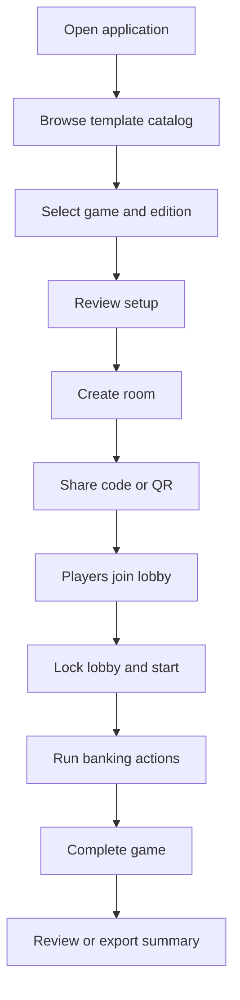
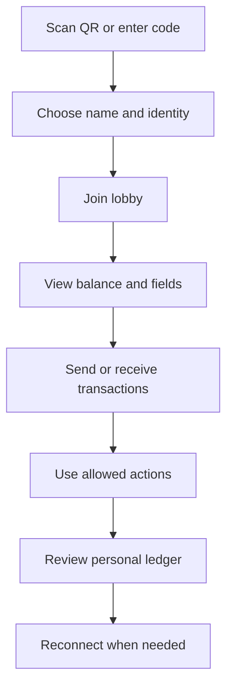

# User Stories and Flows

## Epic: Start a game

### Story

As a host, I want to choose a game and edition so that the correct banker setup is used.

### Acceptance criteria

- The catalog lists only validated templates.
- Each entry shows game name and edition.
- Selecting an entry shows player limits, starting balance, tracked fields, and available actions.
- Starting a game creates a template snapshot and room code.
- A template update after creation does not alter the session.

## Epic: Join a room

### Story

As a player, I want to scan a QR code and join quickly so that setup does not delay the game.

### Acceptance criteria

- The QR code opens the correct room.
- The player enters a display name.
- The server returns a participant ID and reconnect token.
- The lobby updates for all connected users.
- Refreshing the browser restores the same participant when the token remains valid.

## Epic: Perform a transfer

### Story

As a player, I want to pay another player so that the app records the transaction accurately.

### Acceptance criteria

- The player selects a recipient and amount.
- The client shows a clear confirmation.
- The server validates actor, recipient, amount, and overdraft policy.
- Debit and credit occur atomically.
- One ledger transaction links both sides of the transfer.
- All connected clients receive the accepted event.
- Repeating the same command with the same idempotency key does not duplicate the transfer.

## Epic: Use a game action

### Story

As a banker, I want one-tap actions such as payday or fees so that recurring transactions are fast.

### Acceptance criteria

- Actions come from the active template snapshot.
- The UI groups actions by template-defined category.
- The server maps the action to a known declarative operation.
- A batch action reports individual failures before committing, or commits atomically according to the action definition.
- The ledger identifies the action ID and display label.

## Epic: Track custom state

### Story

As a player, I want the app to track facts such as owning a home or having children so that I do not need separate notes.

### Acceptance criteria

- Fields are initialized from the template.
- Field type, limits, options, and default are enforced.
- Host-only fields cannot be modified by players.
- Private fields are visible only to authorized users.
- Every change is recorded in a field-change audit log.

## Epic: Correct a mistake

### Story

As a host, I want to correct an accidental transaction without hiding history.

### Acceptance criteria

- The original entry remains unchanged.
- The correction creates a compensating entry.
- The UI links the correction and original.
- The reason is required.
- Correcting the same entry twice is prevented unless an explicit subsequent adjustment is used.

## Epic: Recover from disconnection

### Story

As a player, I want to reconnect without losing my identity or balance.

### Acceptance criteria

- The client reconnects using a protected token.
- The server sends missed events when feasible or a fresh snapshot.
- The client compares session versions.
- Duplicate commands caused by retries remain idempotent.
- The UI clearly shows disconnected, reconnecting, and synchronized states.

## Primary host journey

## Primary player journey

## Important error flows

- Invalid or expired room code.
- Room locked or full.
- Duplicate display name.
- Player removed by host.
- Insufficient funds.
- Stale command/session version.
- Disconnected during submission.
- Template action unavailable in current session state.
- Invalid field value.
- Correction already applied.
- Session completed or archived.
