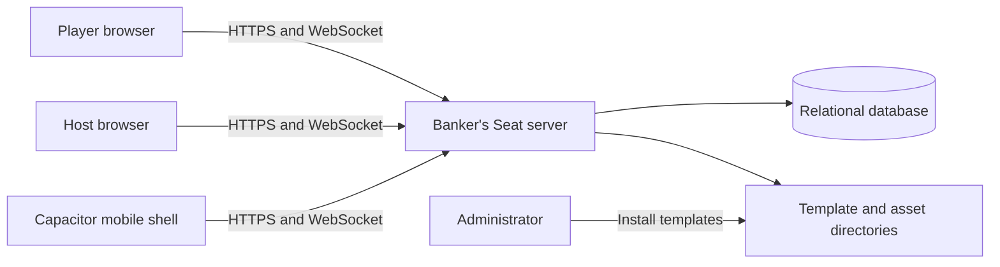
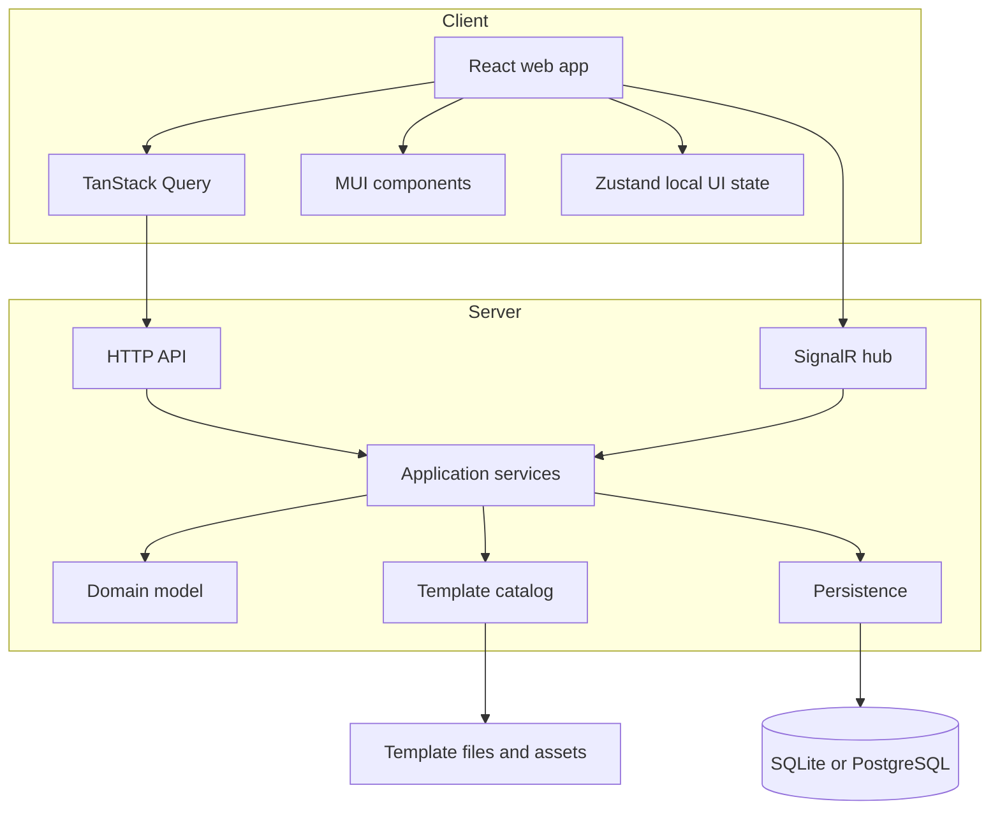

# System Architecture

## Architectural style

Use a modular monolith for the initial release:

- React and TypeScript single-page application.
- ASP.NET Core HTTP API.
- SignalR hub for commands and events.
- Relational persistence.
- File-system-backed template catalog.
- Shared operational deployment.

A modular monolith keeps transactions and deployment simple while preserving boundaries that can later be extracted if scale requires it.

## Context diagram



## Container diagram



## Client modules

### App shell

- Routing.
- Error boundaries.
- Theme.
- localization infrastructure.
- network status.
- install/PWA prompts.

### Template catalog

- Catalog list and filtering.
- Edition details.
- Asset rendering.
- Setup preview.
- Host configuration.

### Lobby

- Room code.
- QR code.
- participant list.
- host controls.
- identity selection.
- connection status.

### Game workspace

- Player balance.
- Custom fields.
- Quick actions.
- Transfer flow.
- Banker console.
- Ledger.
- Session controls.

### Client state rules

- TanStack Query owns HTTP-fetched server state.
- SignalR events update or invalidate relevant query data.
- Zustand stores ephemeral UI state such as open drawers, selected player, pending forms, and local preferences.
- Do not maintain an independent copy of the complete authoritative session in multiple stores.
- A normalized session view model may be derived from the latest server snapshot plus ordered events.

## Server modules

### Sessions

Creates, starts, pauses, completes, and archives game sessions.

### Participants

Handles join, reconnect, host transfer, removal, identity, and permissions.

### Banking

Handles payments, collections, transfers, batch actions, and corrections.

### Player fields

Validates and changes custom template-defined values.

### Templates

Discovers, validates, hashes, versions, and serves templates and assets.

### Real-time gateway

Maps authenticated hub commands to application command handlers and publishes accepted events.

### Persistence

Stores sessions, participants, ledger entries, field values, idempotency records, and template snapshots.

## Deployment modes

### Local single-host

- Docker Compose.
- SQLite.
- Mounted template directory.
- Suitable for home and local network use.

### Hosted single-instance

- Container platform or VM.
- PostgreSQL.
- Object storage or managed volume for template assets.
- Reverse proxy and HTTPS.

### Future horizontally scaled

- PostgreSQL.
- SignalR backplane or managed real-time service.
- Distributed cache for transient connection metadata.
- Shared template/object storage.
- Sticky sessions only if required by the chosen hosting model.

## Repository structure

```text
apps/
  web/
    src/
      app/
      features/
      components/
      hooks/
      lib/
      routes/
  server/
    Api/
    Application/
    Domain/
    Infrastructure/
    Realtime/
packages/
  template-contracts/
  template-tools/
  ui/
templates/
  schema/
  built-in/
  samples/
tests/
  e2e/
  integration/
  template-validation/
```

## Cross-language contracts

JSON Schema is the canonical contract for game templates. HTTP and hub DTOs are explicitly versioned and represented in both TypeScript and C#.

Avoid allowing UI framework types into shared contracts. Runtime validation is required at external boundaries even when compile-time types exist.

## Key design choices

- Server-authoritative state prevents clients from forging balances.
- Append-only ledger preserves trust and correction history.
- Template snapshotting prevents configuration drift.
- Declarative operations avoid unsafe scripting.
- SignalR provides practical real-time behavior with the preferred backend stack.
- Capacitor preserves the React codebase for mobile packaging.
