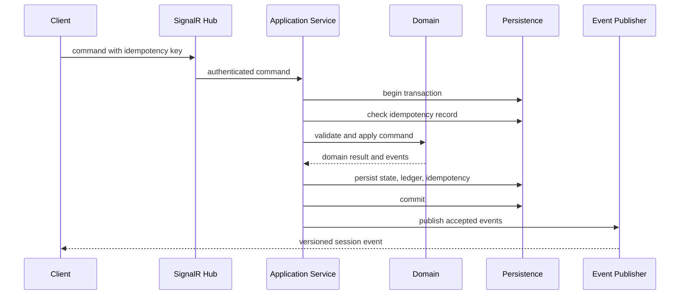

# Domain Model

## Aggregate boundaries

The primary aggregate is `GameSession`. It coordinates lifecycle, participants, accounts, field values, and accepted commands. Ledger entries are append-only records produced by the aggregate's command handlers.

For larger deployments, ledger storage may be optimized separately, but transaction acceptance remains coordinated by the session boundary.

## Core entities

### GameSession

| Field | Description |
|---|---|
| `id` | Globally unique session ID |
| `roomCode` | Short join code |
| `status` | Lobby, active, paused, completed, archived |
| `hostParticipantId` | Current host |
| `templateSnapshotId` | Immutable template snapshot |
| `sessionVersion` | Monotonically increasing accepted-change version |
| `createdAtUtc` | Creation time |
| `startedAtUtc` | Optional start time |
| `completedAtUtc` | Optional completion time |
| `settings` | Session-level permitted overrides |

### TemplateSnapshot

| Field | Description |
|---|---|
| `id` | Snapshot ID |
| `templateId` | Stable template identity |
| `edition` | Edition identity |
| `templateVersion` | Template's semantic version |
| `schemaVersion` | JSON Schema version |
| `contentHash` | Hash of normalized template content |
| `templateJson` | Full validated template |
| `createdAtUtc` | Snapshot time |

### Participant

| Field | Description |
|---|---|
| `id` | Participant ID |
| `sessionId` | Parent session |
| `displayName` | Table-facing name |
| `role` | Host, player, banker, spectator |
| `identityKey` | Selected color/avatar identity |
| `status` | Invited, connected, disconnected, removed |
| `joinOrder` | Stable table ordering |
| `reconnectSecretHash` | Protected reconnect credential |
| `createdAtUtc` | Join time |

### Account

| Field | Description |
|---|---|
| `id` | Account ID |
| `sessionId` | Parent session |
| `ownerType` | Bank, participant, or named shared account |
| `ownerId` | Participant or configured account ID |
| `balance` | Integer base units |
| `version` | Concurrency token |

### LedgerTransaction

A logical operation that may contain one or more balanced ledger postings.

| Field | Description |
|---|---|
| `id` | Transaction ID |
| `sessionId` | Session |
| `sequence` | Strict session order |
| `commandId` | Originating command |
| `actorParticipantId` | Actor |
| `actionId` | Optional template action |
| `kind` | Payment, collection, transfer, adjustment, correction |
| `note` | Optional explanation |
| `correctsTransactionId` | Optional original transaction |
| `createdAtUtc` | Acceptance time |

### LedgerPosting

| Field | Description |
|---|---|
| `id` | Posting ID |
| `transactionId` | Parent transaction |
| `accountId` | Affected account |
| `amount` | Signed integer base units |
| `balanceAfter` | Resulting account balance |

For a transfer, the sum of postings is zero when the bank is modeled as a normal account. Unlimited-bank templates may use a virtual source/sink policy, but the player account mutation must still be recorded.

### PlayerFieldDefinition

Stored in the template snapshot. Defines a stable field ID, label, type, default, limits, options, visibility, and edit permissions.

### PlayerFieldValue

| Field | Description |
|---|---|
| `sessionId` | Session |
| `participantId` | Owner |
| `fieldId` | Stable template field ID |
| `valueJson` | Validated typed value |
| `version` | Concurrency token |
| `updatedAtUtc` | Update time |

### FieldChange

Append-only audit record for a field mutation.

## Value objects

- `MoneyAmount` — signed 64-bit integer base units.
- `RoomCode` — normalized short code.
- `TemplateIdentity` — template ID, edition ID, template version.
- `SessionVersion` — monotonically increasing integer.
- `IdempotencyKey` — client-generated unique string scoped to actor/session.
- `AssetPath` — validated relative path.
- `FieldId`, `ActionId`, `ParticipantId`, `AccountId`.

## Commands

- `CreateSession`
- `JoinSession`
- `ReconnectParticipant`
- `StartSession`
- `PauseSession`
- `ResumeSession`
- `CompleteSession`
- `TransferHost`
- `RemoveParticipant`
- `PayFromBank`
- `CollectToBank`
- `TransferBetweenPlayers`
- `ExecuteTemplateAction`
- `UpdatePlayerField`
- `CorrectTransaction`
- `AddTransactionNote`

## Domain events

- `SessionCreated`
- `ParticipantJoined`
- `ParticipantReconnected`
- `SessionStarted`
- `SessionPaused`
- `SessionResumed`
- `SessionCompleted`
- `HostTransferred`
- `ParticipantRemoved`
- `TransactionPosted`
- `TransactionCorrected`
- `PlayerFieldChanged`
- `SessionSnapshotRequired`

## Invariants

1. A completed or archived session rejects financial mutations.
2. A lobby session rejects normal gameplay transactions unless explicitly allowed for setup.
3. Every participant account belongs to the same session as the command.
4. A transfer amount is positive at the command boundary.
5. A transaction's postings are atomic.
6. Overdraft policy is enforced before mutation.
7. A correction cannot erase or alter the original transaction.
8. A single original transaction cannot be corrected twice by the simple correction command.
9. Stable template IDs and field/action IDs cannot be duplicated.
10. The session version increments once per accepted state-changing command.
11. The same actor/idempotency key returns the original accepted result.
12. A running session uses only its template snapshot.

## Command processing sequence

