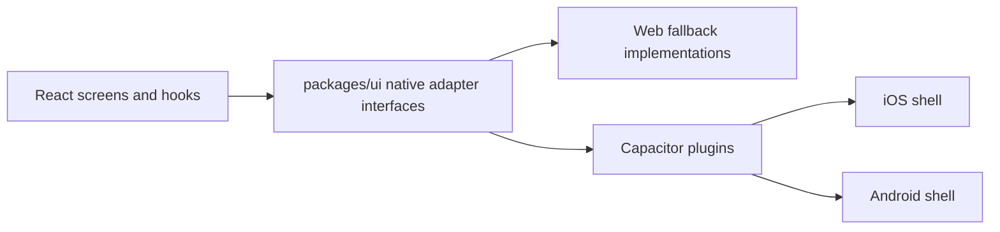

# Phase 6 — Hybrid Mobile

## Status

Phase 6 is complete. Banker's Seat now includes a Capacitor-ready mobile shell, interface-first native adapters, and React hooks that keep Capacitor APIs out of feature components.

## Architecture overview



- `packages/ui/src/services/native` contains the mobile-facing service contracts.
- React hooks in `apps/web/src/hooks` consume those contracts.
- Feature components call hooks only; they do not import Capacitor plugins directly.
- Web implementations remain safe fallbacks for browsers and desktop PWA usage.

## Native adapter pattern

The adapter layer currently exposes seven services:

- `ISecureStorageService`
- `IHapticsService`
- `IShareService`
- `IQrScannerService`
- `IDeepLinkService`
- `INetworkStatusService`
- `ICrashReportingService`

Design rules:

1. Interfaces define the app contract first.
2. Web fallbacks preserve Phase 1-5 behavior.
3. Native-only behavior is isolated behind adapter boundaries.
4. Hooks manage React lifecycle concerns such as subscriptions and async state.

## Setup instructions

1. Install workspace dependencies:

   ```bash
   pnpm install
   ```

2. Build the web app:

   ```bash
   pnpm --filter @bankers-seat/web build
   ```

3. Add a native platform when ready:

   ```bash
   pnpm --filter @bankers-seat/mobile exec cap add android
   pnpm --filter @bankers-seat/mobile exec cap add ios
   ```

4. Sync the web build into Capacitor:

   ```bash
   bash scripts/mobile/build-mobile.sh
   ```

5. Refresh icons and splash assets after adding `apps/mobile/assets/icon.png`:

   ```bash
   bash scripts/mobile/update-assets.sh
   ```

## Deep linking configuration

The mobile join-link format is:

```text
https://example.com/join/ABCD12
```

Implementation notes:

- The web router now accepts `/join/:roomCode`.
- QR invitations encode the deep-link URL, not only the raw room code.
- `DeepLinkService` parses join links and normalizes room codes.
- Capacitor deep-link handling uses the `App` plugin through the adapter layer.

Native platform follow-up after running `cap add`:

- iOS: register your custom scheme or universal-link association in `Info.plist`.
- Android: add an `intent-filter` for the join-link host or custom scheme.
- Keep the server route and native app-link configuration aligned.

## Secure storage best practices

- Store reconnect credentials and similar device-bound secrets through `ISecureStorageService`.
- Treat web `localStorage` as a compatibility fallback, not strong protection.
- Prefer clearing credentials on explicit logout or session handoff.
- Keep stored values narrow and avoid persisting whole snapshots.
- Never trust client storage as authoritative session state.

## Publishing workflow outline

1. Build and validate the web app.
2. Sync assets and web output into Capacitor.
3. Add or refresh native platforms.
4. Apply platform signing configuration from `apps/mobile/signing`.
5. Produce Android and iOS release builds in native tooling.
6. Run smoke tests on physical devices.
7. Submit store-ready artifacts with privacy disclosures for storage and camera usage.

## Verification summary

- 7 adapter services implemented with web fallbacks.
- 41 service unit tests added in `packages/ui`.
- React integration hooks added in `apps/web/src/hooks`.
- Capacitor shell scaffolded in `apps/mobile`.
- Mobile build and asset scripts added in `scripts/mobile`.
